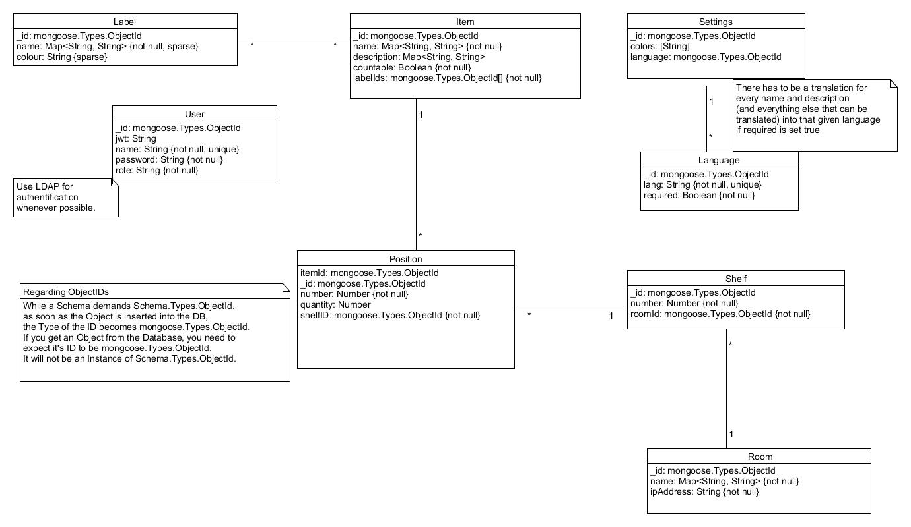

The Backend-Database uses MongoDB.
It saves the entities the backend works with: users, items, positions, shelves, rooms, tags, settings and languages.

### Requirements
[UMLet](https://www.umlet.com/)

### Code for UMLet
[databaseEntityRelationships.uxf](https://github.com/PBL-Pick-By-Light/BE-Backend/blob/development/docs/wiki/images/databaseEntityRelationships.uxf)

### Description
* item: An item represents a product stored in a position in a shelf in a room. 
* label: Items can be descirbed with some labels. 
* language: There is the opportunity to use the app in different languages, therefore the language module exists. 
* user: To get access to the app, the user has to be registrated in the database or in ldap. Users have different permissions to use functionalities from the app. The permissions are saved in the role of the user. There are three different roles for user: admin, editor and user. 
* position: A position contains an item. 
* shelf: A shelf contains positions. 
* room: A room contains shelves.
